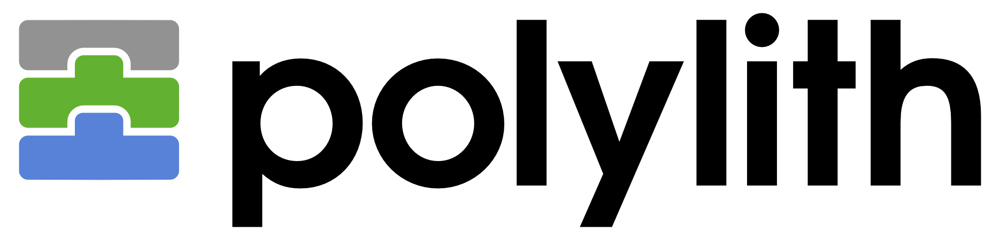

Polylith documentation can be found here:

- The [high-level documentation](https://polylith.gitbook.io/polylith)
- The [Polylith Tool documentation](https://github.com/tengstrand/lein-polylith)
- The [RealWorld example app documentation](https://github.com/furkan3ayraktar/clojure-polylith-realworld-example-app)

You can also get in touch with the Polylith Team via our [forum](https://polylith.freeflarum.com).

<h1>BurnUp</h1>

BurnUp is a proof-of-concept/toy-model for a contracting/job site for the energy industry. The backend is written in Clojure using polylithic architecture and complies with the RealWorld API spec. The app is largely built around the Compojure library, with the Luminus framework used sparingly.
Because of the RealWorld spec, it can be paired with any similarly implemented front-end.
However, for the purposes of this PoC, the front ends for mobile and desktop devices
will be written in ClojureScript, targeting Native and React frameworks through wrappers. 

<h2> Frontends </h2>

 Frontends to be implemented once core systems of backend are functioning <p2>

<h3> Installation </h3>

  

<h4>Implementation Details</h4>
<ul>
  <li> Users: A user can either be a contractor or an organisation. While the implementation does not explicitly use inheritance, Clojure and Datomic are flexible and fine-grained enough to allow them to be distinct "classes" without complicating behaviours such as logging in. To expand on the example, on log-in the database is queried for all user nodes with a matching username-password pair, without needing to distinguish between the two types of user, and serves the relevant usertype-specific resources once the user type is checked after authentication. Components can inherit from each other like classes in a loose sense via dependencies. Class hierarchy is also implemented in this fashion.
    <ul>
      <li> Contractor: Has a profile with employment details such as rate etc., may tender proposals to contracts. </li>
      <li> Organisation: Has a more limited profile with company contact details, may generate contracts. May be further expanded to distinguish between operators and service providers.</li>
    </ul>
  </li>
  <li> Contracts: Generated as a node with an edge to the generating organisation.
    When a proposal is accepted, an edge from the contractor to the contract is generated.</li>
  <li> Proposals: Generated by contractors and must be associated with an existing Contract node. </li>
  <li> Database: Graph Database implemented in Datomic. For development purposes, and to make demonstration easier, the database itself is run entirely as an anonymous instance in memory. Schemata and seeded database entries are loaded in from a .edn file on launch. </li>
  <li> Instant Messaging System: Potential feature. Initial implementation would be limited to communication between contractors and organisations during contract negotiation and for active projects </li>

</ul>
